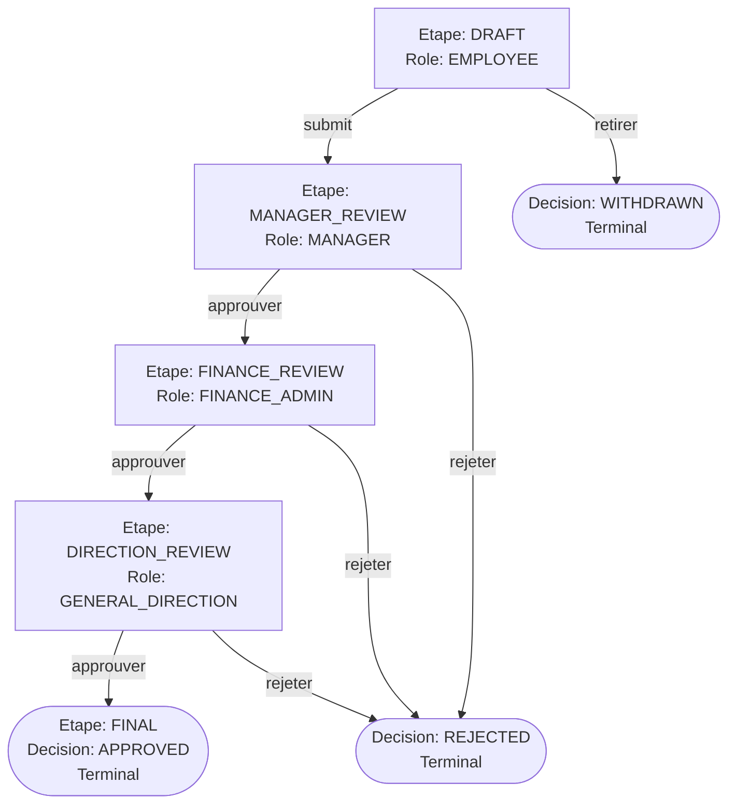

# DéplacementApp — Travel Request Management

A multi-stage business travel request system designed for Moroccan organisations (**Sociétés**). Employees submit travel requests (**DemandesDeplacement**) that flow through a strict 5-stage approval pipeline (**Etape** + **Decision**) with role-based access control, in-app notifications, company-branded emails (**EmailSender**), audit logging (**JournalAudit**), and PDF export.

---

## Quick Start

**Prerequisites:** Docker & Docker Compose, Git

```bash
git clone https://github.com/mustaphaelou/deplacementapp.git
cd deplacementapp
cp .env.example .env
npm run docker:dev
```

Open [localhost:3000](http://localhost:3000). On initial startup, the login page presents a **setup wizard (amorçage)** to configure your **Societé**, initial **Départements**, and primary administrative **Utilisateur**. Local development emails are captured via [Mailpit](http://localhost:8025).

---

## Domain Model & Workflow

The application adheres to a strict domain vocabulary defined in [CONTEXT.md](CONTEXT.md). 

### Core Concepts

| Term | Definition |
|------|------------|
| **Societé** | The organisation deploying the application instance. Controls visual identity (name, logo, theme) and email identity. |
| **DemandeDeplacement** | A travel request submitted by an employee. Preserves an immutable snapshot of employee details at creation. |
| **Utilisateur** | A user assigned to exactly one **Departement** and **Societé**, with one of 4 roles. |
| **Etape** | The current position in the approval pipeline (`DRAFT`, `MANAGER_REVIEW`, `FINANCE_REVIEW`, `DIRECTION_REVIEW`, `FINAL`). |
| **Decision** | The outcome recorded at an **Etape** (`PENDING`, `APPROVED`, `REJECTED`, `WITHDRAWN`). Terminal outcomes permanently freeze the request. |
| **Assignataire** | The user who recorded the last `approuver` or `rejeter` decision on a request. |

---

### Approval Pipeline

Every **DemandeDeplacement** moves through 5 defined stages. At each stage, exactly one **Role** is authorized to act:



#### Stage Permissions & Actions

| Etape | Authorized Role | Allowed Actions | Next State on Approval | Outcome on Rejection / Withdrawal |
|-------|-----------------|-----------------|------------------------|----------------------------------|
| **DRAFT** | `EMPLOYEE` (Owner) | `submit`, `retirer` | `MANAGER_REVIEW` | `WITHDRAWN` (Terminal) |
| **MANAGER_REVIEW** | `MANAGER` | `approuver`, `rejeter` | `FINANCE_REVIEW` | `REJECTED` (Terminal) |
| **FINANCE_REVIEW** | `FINANCE_ADMIN` | `approuver`, `rejeter` | `DIRECTION_REVIEW` | `REJECTED` (Terminal) |
| **DIRECTION_REVIEW** | `GENERAL_DIRECTION` | `approuver`, `rejeter` | `FINAL` | `REJECTED` (Terminal) |
| **FINAL** | *None* | *Read-only* | *Terminal state* | `APPROVED` (Terminal) |

---

## Deployment

Deploy on a Linux VPS using Docker Compose with bundled PostgreSQL database.

### 1. Production Docker Compose (`compose.prod.yml`)

```yaml
services:
  db:
    image: postgres:16-alpine
    restart: unless-stopped
    volumes:
      - pgdata:/var/lib/postgresql/data
    environment:
      - POSTGRES_USER=${POSTGRES_USER}
      - POSTGRES_PASSWORD=${POSTGRES_PASSWORD}
      - POSTGRES_DB=${POSTGRES_DB}
    healthcheck:
      test: ["CMD-SHELL", "pg_isready -U ${POSTGRES_USER} -d ${POSTGRES_DB}"]
      interval: 5s
      timeout: 5s
      retries: 10
      start_period: 15s

  migrate:
    build:
      context: .
      dockerfile: Dockerfile
      target: migrator
    depends_on:
      db:
        condition: service_healthy
    environment:
      - DATABASE_URL=${DATABASE_URL}

  app:
    build:
      context: .
      dockerfile: Dockerfile
      target: runner
    depends_on:
      migrate:
        condition: service_completed_successfully
    ports:
      - "3000:3000"
    environment:
      - DATABASE_URL=${DATABASE_URL}
      - BETTER_AUTH_SECRET=${BETTER_AUTH_SECRET}
      - BETTER_AUTH_URL=${BETTER_AUTH_URL}
      - SMTP_HOST=${SMTP_HOST}
      - SMTP_PORT=${SMTP_PORT}
      - SMTP_USER=${SMTP_USER}
      - SMTP_PASS=${SMTP_PASS}
      - SMTP_FROM=${SMTP_FROM}

volumes:
  pgdata:
```

### 2. Environment Variables

Configure `.env`:

```bash
DATABASE_URL=postgresql://user:pass@db:5432/deplacementapp
POSTGRES_USER=user
POSTGRES_PASSWORD=<strong-password>
POSTGRES_DB=deplacementapp
BETTER_AUTH_SECRET=<generate with: openssl rand -base64 32>
BETTER_AUTH_URL=https://your-domain.com
SMTP_HOST=smtp.your-provider.com
SMTP_PORT=587
SMTP_USER=your-smtp-user
SMTP_PASS=your-smtp-pass
SMTP_FROM=noreply@your-domain.com
```

### 3. Build & Run

```bash
npm run docker:prod
```

Uploads (such as avatars) persist automatically in named volumes.

---

## Project Structure

```
├── app/                     # Next.js App Router (pages & API routes)
│   ├── (auth)/login/        # Authentication & setup wizard (amorçage)
│   ├── (dashboard)/         # Dashboard, demandes, administration, profil
│   └── api/                 # REST API endpoints & route handlers
├── components/              # React components
│   ├── ui/                  # Base UI primitives & shadcn/ui components
│   ├── pdf/                 # PDF templates & adapters (@react-pdf/renderer)
│   └── ...
├── lib/                     # Business logic & domain models
│   ├── demande/             # Hexagonal architecture (ports, adapters, state machine)
│   │   ├── effets-transition.ts # Transition side-effects seam (JournalAudit + Notifications)
│   │   └── ...
│   ├── email-sender.ts      # EmailSender module (SMTP transport & identity resolution)
│   ├── audit.ts             # JournalAudit logger (logAudit)
│   └── authorization.ts     # Role-based access control rules
├── db/                      # Drizzle ORM schema, migrations & seed scripts
├── CONTEXT.md               # Strict domain glossary & ubiquitous language
└── Dockerfile               # Multi-stage container build (migrator, runner)
```

---

## Tech Stack

| Category | Technology |
|----------|------------|
| **Framework** | [Next.js 16](https://nextjs.org/) (App Router, Turbopack) |
| **Language** | [TypeScript](https://www.typescriptlang.org/) |
| **UI System** | [React 19](https://react.dev/), [Tailwind CSS v4](https://tailwindcss.com/), [shadcn/ui](https://ui.shadcn.com/) on [Base UI](https://base-ui.com/), [Hugeicons](https://hugeicons.com/) & [Lucide](https://lucide.dev/) |
| **Authentication** | [Better Auth](https://better-auth.com/) (mapped onto the existing Utilisateur table) |
| **Database & ORM** | [PostgreSQL](https://www.postgresql.org/) with [Drizzle ORM](https://orm.drizzle.team/) |
| **Forms & Validation** | [React Hook Form](https://react-hook-form.com/) + [Zod](https://zod.dev/) |
| **PDF Generation** | [@react-pdf/renderer](https://react-pdf.org/) |
| **Email Delivery** | [Nodemailer](https://nodemailer.com/) |
| **Containerization** | [Docker](https://www.docker.com/) (Multi-stage build) |
| **Testing** | [Vitest](https://vitest.dev/) |

---

## Scripts

| Command | Description |
|---------|-------------|
| `npm run dev` | Start development server (Turbopack) |
| `npm run build` | Build production Next.js application |
| `npm run start` | Start production Next.js server |
| `npm run lint` | Run ESLint static code analysis |
| `npm run format` | Format TypeScript & React source files with Prettier |
| `npm run typecheck` | Perform TypeScript type verification (`tsc --noEmit`) |
| `npm test` | Execute test suite via Vitest |
| `npm run test:watch` | Execute Vitest in watch mode |
| `npm run drizzle:generate` | Generate Drizzle migrations from schema changes |
| `npm run drizzle:migrate` | Apply pending Drizzle migrations to database |
| `npm run drizzle:push` | Push schema changes directly to database |
| `npm run drizzle:studio` | Launch interactive Drizzle Studio UI |
| `npm run docker:dev` | Launch local development Docker Compose stack |
| `npm run docker:prod` | Launch production Docker Compose stack |
| `npm run docker:down` | Stop Docker Compose stack and remove volumes |

---

## License

[MIT](LICENSE)
